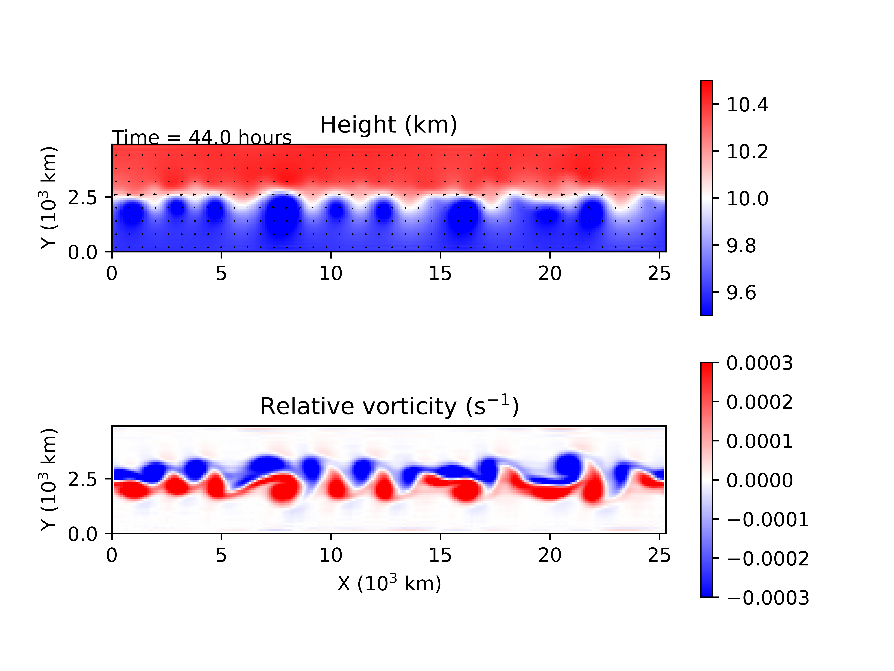

> Here documents a very simple shallow water model realized using C++. I learned a lot of numerical methods, however, this is the first time I try to build a toy model from the beginning. The main purpose of this project is to apply all those things I learned from atmospheric dynamics and numerical methods for PDE and provide a playground for CS techniques like MPI, CUDA and Docker et al.
>
> I assume readers have already know the basic atmospheric dynamics and some numerical methods. Some md files contain some math, readers can download and open it using [Typora](https://www.typora.io/) for better experience.

# Shallow-Water-Model: Theory

[001. Shallow Water Model](./UserGuide/001.Shallow-Water-Model.md)

[002. Solution: Lax-Wendroff Scheme](./UserGuide/002.Solution-Lax-Wendroff.md)


# Shallow-Water-Model: Appendix

[Appendix 001. Lax-Wendroff-scheme](./UserGuide/Appendix.001.Lax-Wendroff-scheme.md)

[Appendix 002. Constructing-scheme-based-on-characteristics](./UserGuide/Appendix.002.Constructing-scheme-based-on-characteristics.md)


# Shallow-Water-Model: User's Guide

1. create initial field:

   modify `util/setting.py` and then run `util/create_initial_condition.py`. 5 files contain initial and static information would be created in `init_data`;

2. compile:

   just `make all`;

3. run:

   `./SWM.exe`, all output data would be put in `out_data`

4. plot result:

   run `util/plot_fig.py`


# Shallow-Water-Model: Application

### Pure Graviy Wave

```
flat orography 
gaussian blob initial condition
non-geostrophic balance initial condition
f = 0
beta = 0
```


### Kelvin Wave

Kelvin wave is a kind of gravity wave

```
flat orography
gaussian blob initial condition
non-geostrophic balance initial condition
do not add noise to initial condition
f0 = 0
beta = 5e-10
```


### Barotropic Instability

```
flat orography
zonal jet initial condition
geostrophic balance initial condition
add some noise to initial field
f = 1.e-4
beta = 1.6e-11
```



This is an interesting experiment. 

Jet is not a wave, however, the meandering of jet is a wave. Barotropic instability is a wave produce mechanism in jet.


### Jupiter's Great Red Spot

```
flat orography
sinusoidal initial condition
geostrophic balance initial condition
add some noise to initial field
```


### Orographic Rossby Wave

```
gaussian mountain orography
uniform westerly initial condition
geostrophic balance initial condition
```

# Reference
https://personalpages.manchester.ac.uk/staff/paul.connolly/teaching/practicals/shallow_water_equations.html

